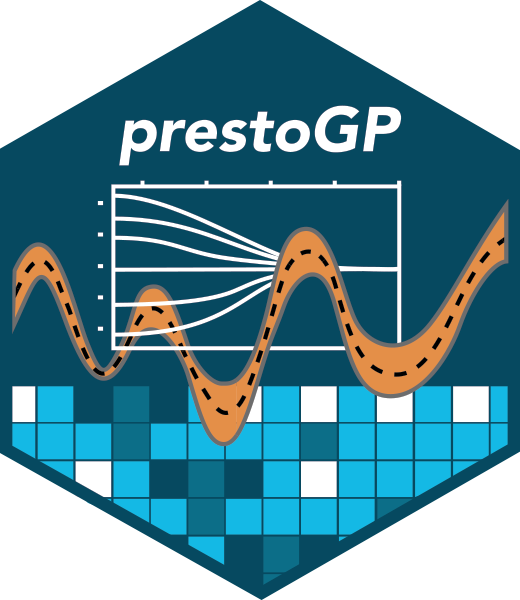

## **PrestoGP**: **P**enalized **Re**gression on **S**patio-**T**emporal **O**utcomes using **G**aussian **P**rocess

[](https://github.com/NIEHS/PrestoGP/actions/workflows/check-standard.yaml)
[](https://github.com/NIEHS/PrestoGP/actions/workflows/test-coverage.yaml)
[](https://github.com/NIEHS/PrestoGP/actions)
[](https://github.com/NIEHS/PrestoGP/actions/workflows/lint.yaml)
[](https://github.com/NIEHS/PrestoGP/actions/workflows/pkgdown.yaml)



# Overview

PrestoGP is an R package for scalable penalized regression on spatio-temporal outcomes using Gaussian processes. The package includes the methods described in the paper "Scalable penalized spatiotemporal land-use regression for ground-level nitrogen dioxide" by Messier and Katzfuss (2020). The package is designed to handle big data and is useful for large-scale geospatial exposure assessment and geophysical modeling. PrestoGP expands the methods in Messier and Katzfuss (2020) to include the following important feature:

1. Multivariate spatiotemporal outcomes using multivariate Matern Gaussian process. The method is described in the paper "A valid Matérn class of cross-covariance functions for multivariate random fields with any number of components" by Apanasovich, Genton, and Sun (2012).

2. Simultaneous variable selection and estimation of the fixed effects (i.e. land-use regression variables) and the spatiotemporal random effects. The method is described in the paper "Scalable penalized spatiotemporal land-use regression for ground-level nitrogen dioxide" by Messier and Katzfuss (2020).

3. Censored outcomes using the Tobit likelihood and imputation via the EM algorithm. 

4. And as always, scalability of the Gaussian Process via the General Vecchia approximation as described in the paper "A general framework for Vecchia approximations of Gaussian processes" by Katzfuss and Guinness (2021).


# Installation

You can install the development version of PrestoGP from GitHub with:

``` r
# install.packages("devtools")
devtools::install_github("NIEHS/PrestoGP")
```

# Work In Progress

This package is currently under development. Please report any issues on the [Issues page](https://github.com/NIEHS/PrestoGP/issues)


### Multivariate and Censored Geospatial Models For External Exposomics of Data-Sparse Chemicals: United States Chlorotriazine Groundwater Distributions from 1990-2022

The manuscript is in progress and expected to be submitted soon. Please check back for updates or contact Kyle Messier for more information.

### Authors
- Kyle P Messier<sup>1,2</sup>
- Insang Song<sup>1,2</sup>
- Matt W Wheeler<sup>2</sup>
- Myeongjon Kang<sup>4</sup>
- Matthias Katzfuss<sup>4</sup>
- Ruchir R Shah<sup>3</sup>
- Deepak Mav<sup>3</sup>
- Brian Kidd<sup>3</sup>
- Eric Bair<sup>3</sup>

### Affiliations
1. National Institute of Environmental Health Sciences, Division of the National Toxicology Program, Predictive Toxicology Branch
2. National Institute of Environmental Health Sciences, Division of Intramural Research, Biostatistics and Computational Biology Branch
3. Sciome, LLC
4. University of Wisconsin, Department of Statistics
